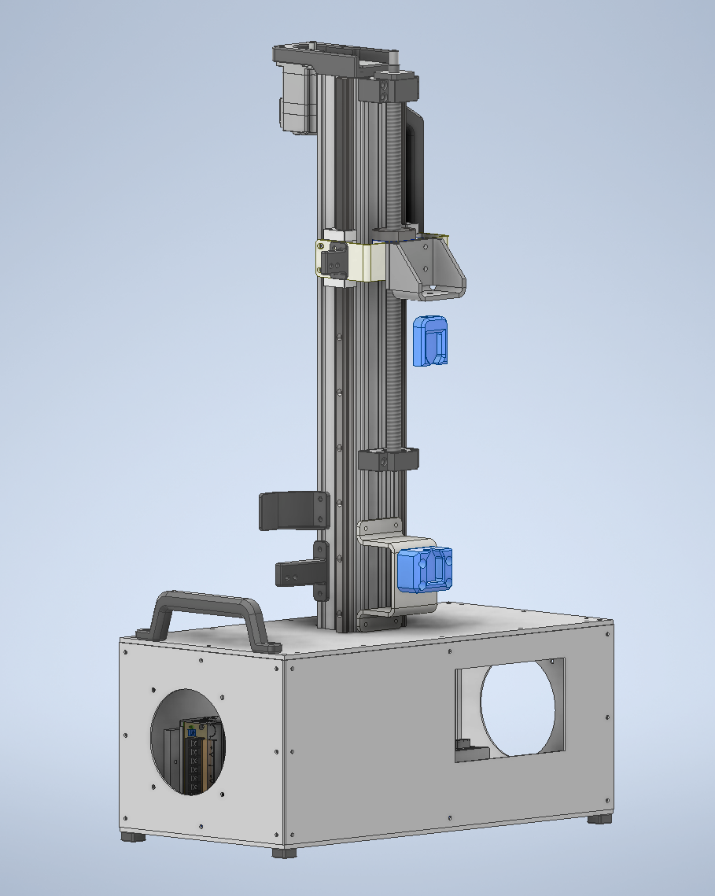
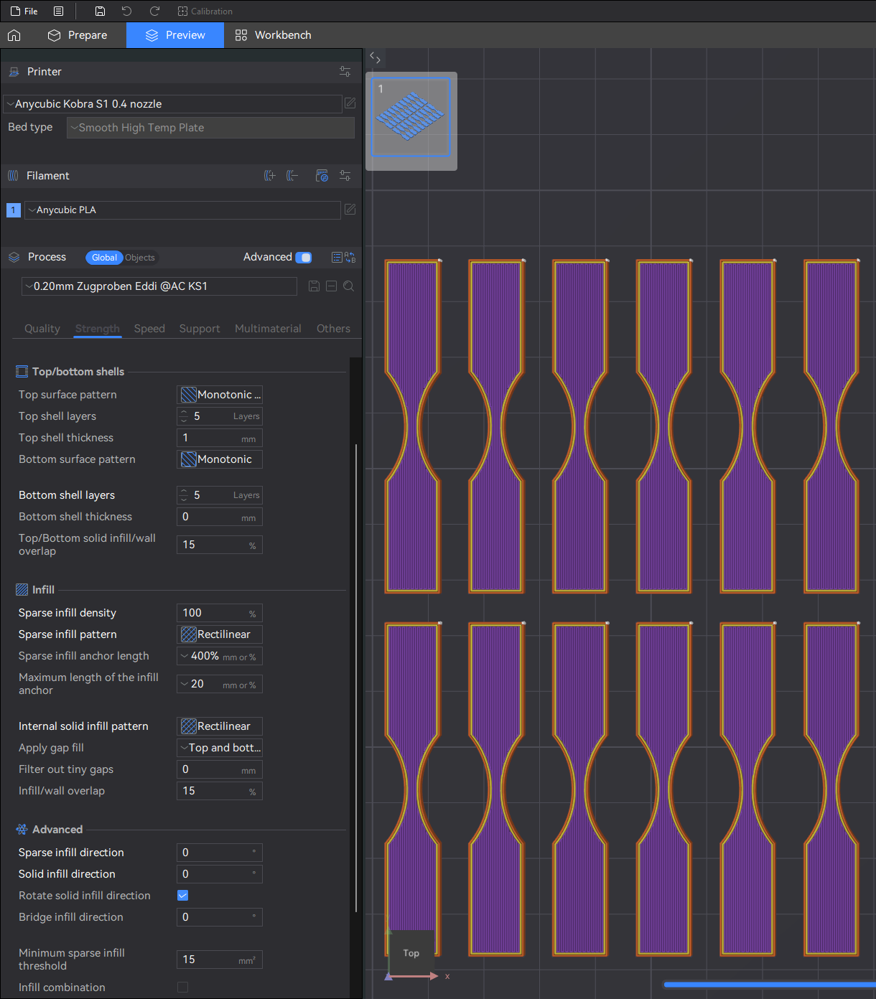

# Desktop Tensile Testing Machine

## Overview

The tensile testing machine described here is a fully open-source device designed to determine the mechanical tensile strength of test specimens. At its core, it uses a single-board computer (typically a Raspberry Pi), which, in combination with a load cell and an HX711 amplifier, performs precise force measurements. A bipolar stepper motor module ensures defined positioning and feed control, enabling reproducible loading profiles.
The goal of the project is to provide an affordable and modular testing rig that can be used and further developed by both hobbyists and research laboratories. Control is provided via an intuitive touch GUI (based on ttkbootstrap and tkinter), which visualizes all relevant parameters—test length, feed rate, and force-drop threshold—in real time and automatically saves measurement data to CSV logs.
Thanks to the MIT open-source license, the entire source code is freely available on GitHub. The modular architecture and clear interfaces allow for customization, extensions, and the integration of additional sensors or actuators. This makes the tensile tester a flexible platform for material testing, educational purposes, and DIY projects.

Please Note: a good part of this project is made in german language

If you want to contribute please let me know 

## Features

- **Precise Force Measurement**  
  Load cell with HX711 amplifier, tare & calibration routines.
- **Stepper Motor Control**  
  Configurable pull‑rate, travel distance, and emergency stop on force drop.
- **Intuitive Touch GUI**  
  Built with `ttkbootstrap` + `tkinter` for live feedback and parameter adjustment.
- **Automatic Logging**  
  CSV log files with position vs. force data, auto‑incrementing filenames.

## Requirements

- **Hardware**  
  - Raspberry Pi (5)  
  - HX711 load cell amplifier + load cell  
  - Bipolar stepper motor (Nema 23) + driver (enable, dir, step pins) (3,3V compatible) 
- **Software**  
  - Python 3.11 < 
  - MicroPython (for MCU variant)  
  - `gpiozero`  
  - `ttkbootstrap`  
  - `tkinter`

## Samples 

For good compareable data i would suggest you use the "sample typ cw" from this ropository. The infill should be 100%, the infill pattern rectalinear, with 2 wall loops. This will enshure you will get a homogeneous as possible infill as seen on th picture. Theres als a .3mf data in this repository you could use in Orca Slicer or "Anycubic next" Slicer. The sample contour is fetched from the ISO 20753, also to have good comparable data.

## Addition Milled Sample Holder (10.05.2025)

For a more consistant i've ordered a new sample holder milled from EN-AW7075 aluminum.
You will find the data to that in 3D files and CNC Milled Tool for Type CW

